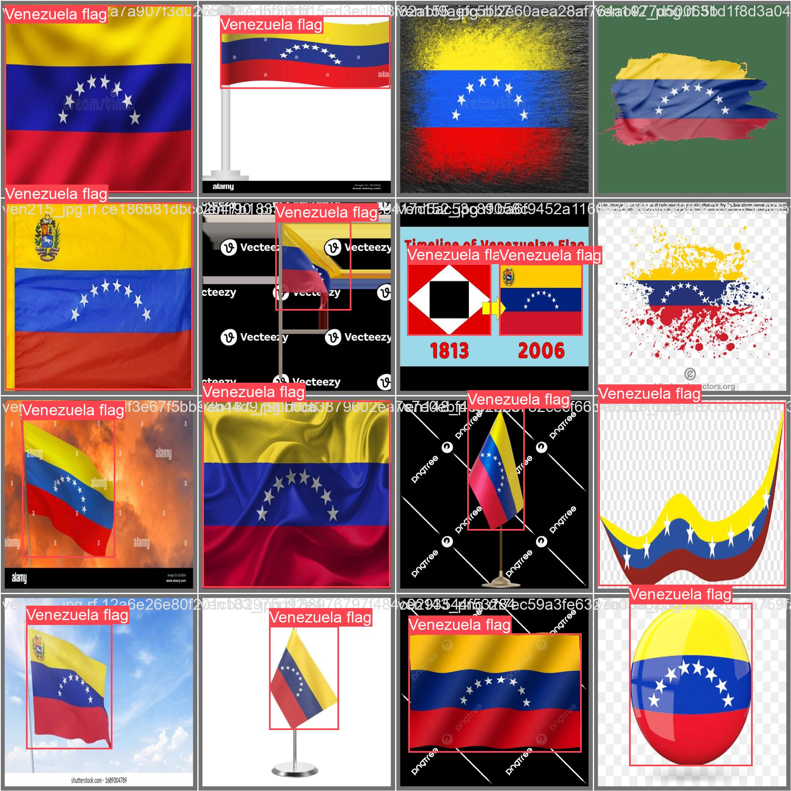
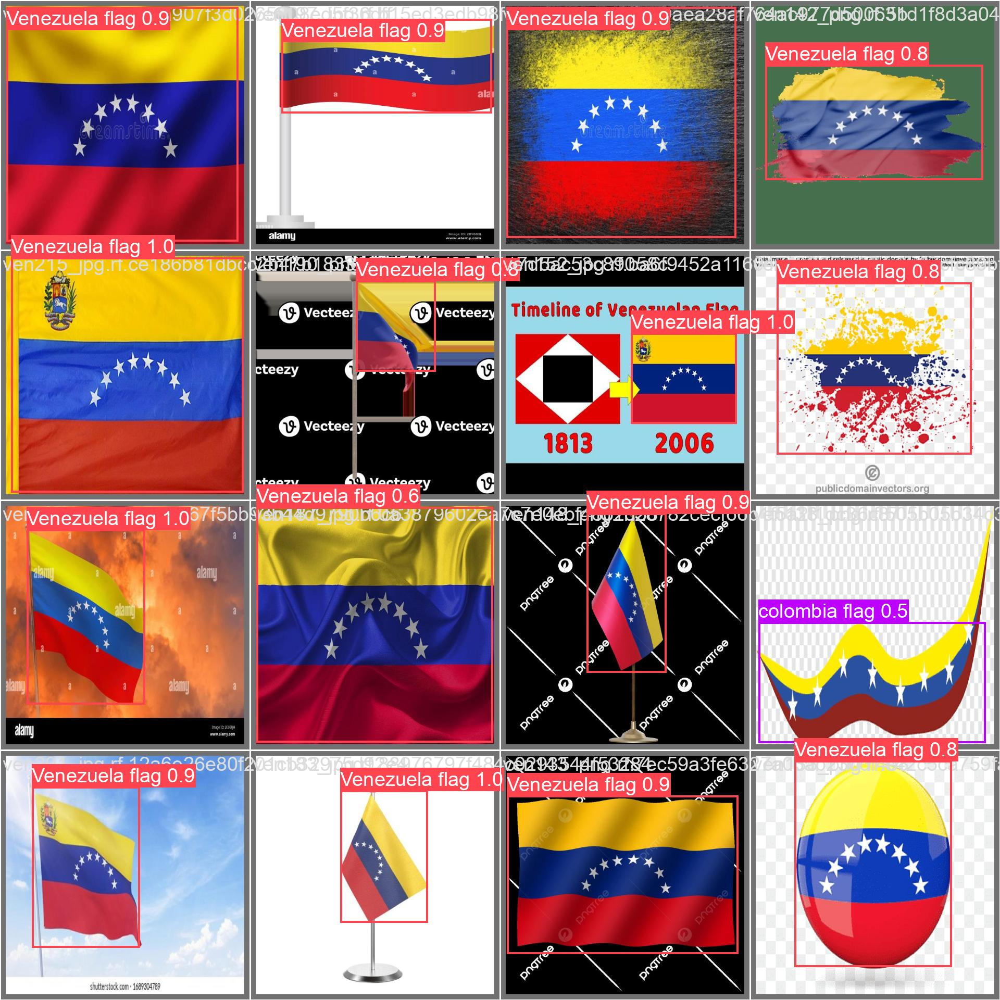
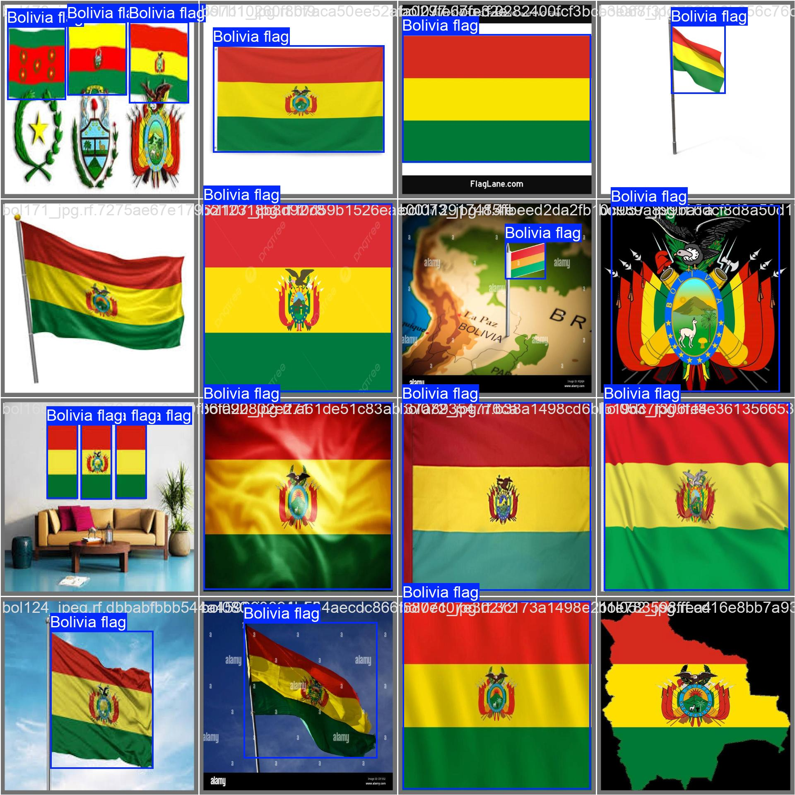
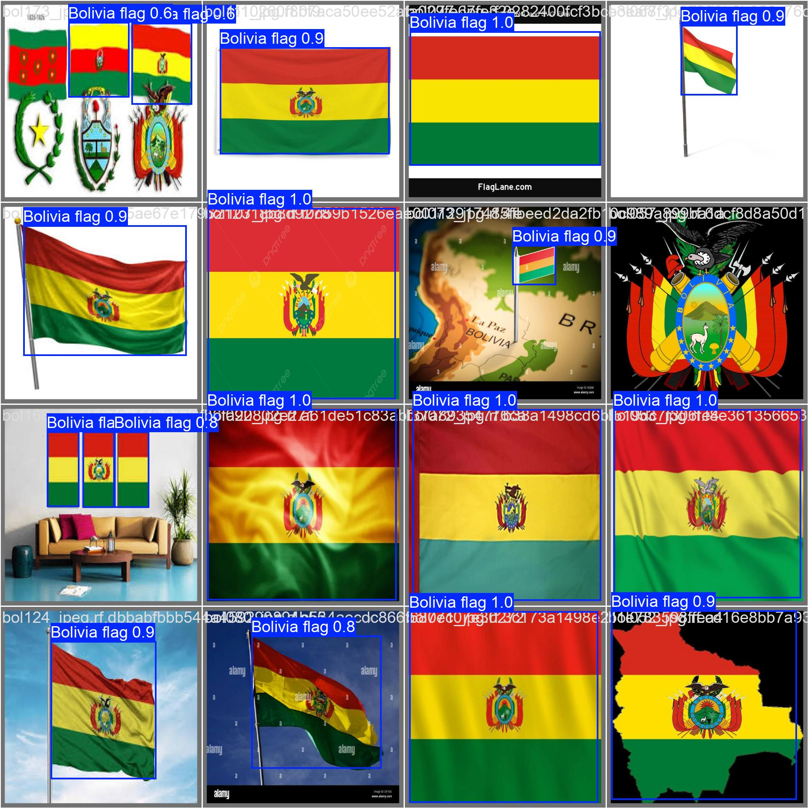
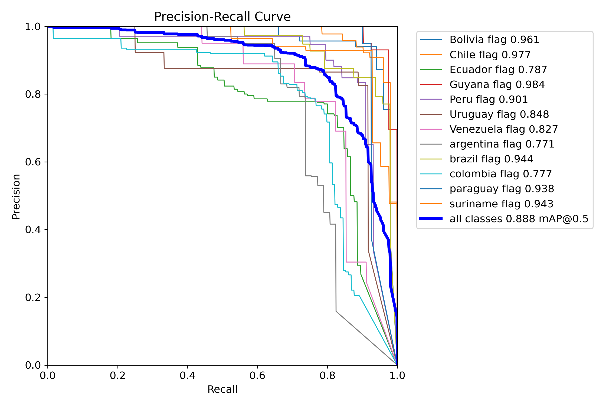
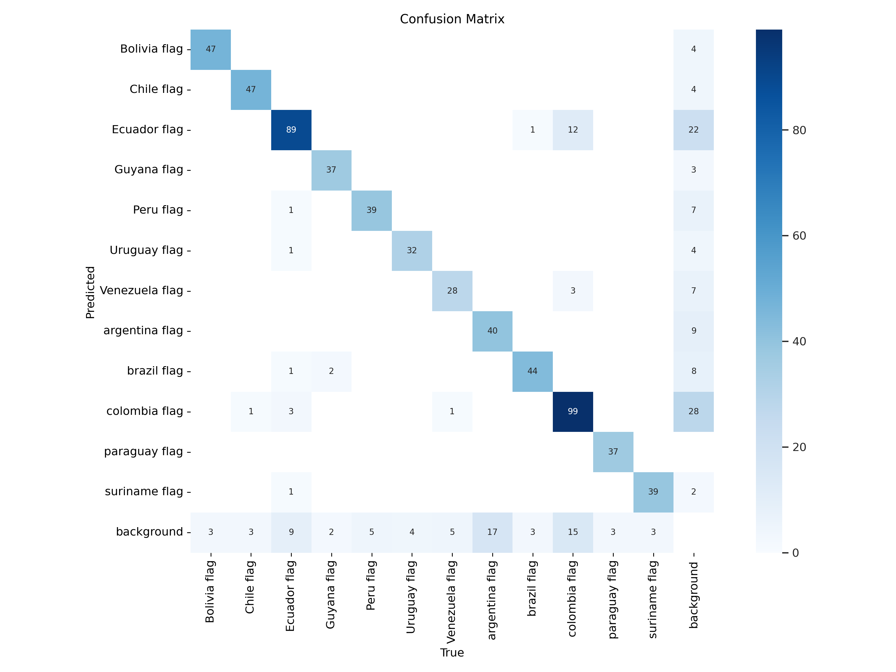
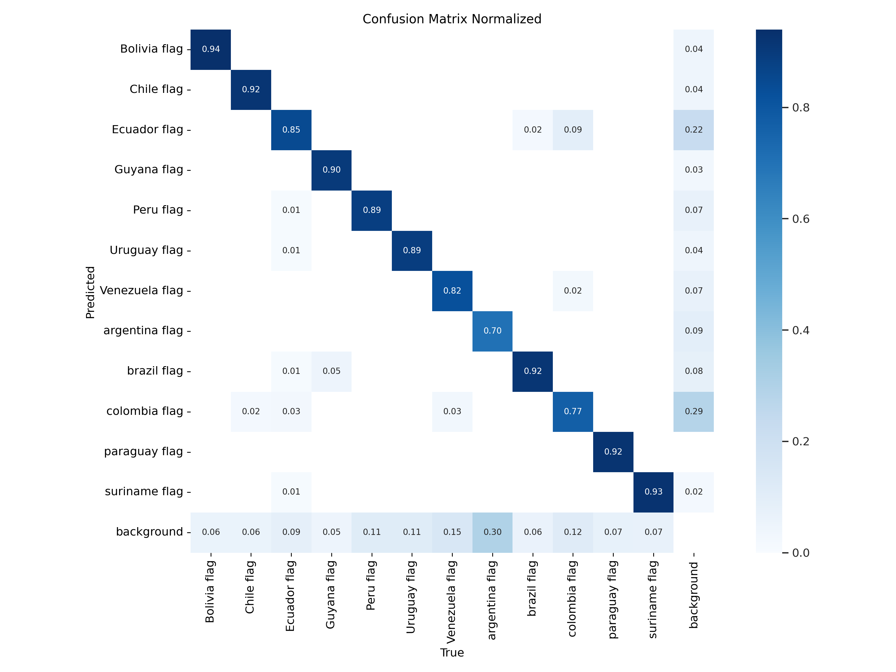

<h1 align="center">Flag Detection with YOLOv8</h1>

  <b>YOLOv8-based object detection model to recognize South American flags.</b> 
  <i>Trained on a custom dataset with 12 country flags, evaluated using precision, recall, and confusion matrix.</i>

##  Our Dataset

**Download Link:**  
[**FlagDetect.v1i.yolov8.zip (386 MB)**](https://huggingface.co/datasets/7mgppp/south-american-flags/blob/main/FlagDetect.v1i.yolov8.zip)

**Description:**  
This dataset contains labeled images of **South American flags** formatted for **YOLOv8** object detection. It includes:

- Training images  
- Validation images  
- Test images  
- Bounding box annotations in YOLOv8 format

---

## Tools & Tech Used

- Python
- Ultralytics YOLOv8
- Custom flag dataset 

---

## Demo Predictions

Here are some sample validation predictions generated by the model:

<table>
<tr>
<td><b>Ground Truth</b></td>
<td><b>Prediction</b></td>
</tr>
<tr>
<td></td>
<td></td>
</tr>
<tr>
<td></td>
<td></td>
</tr>
</table>

---

## Model Performance

### Precision-Recall Curve

- **Top Performing Classes:**
  - 🇬🇾 Guyana: `0.984`
  - 🇨🇱 Chile: `0.977`
  - 🇧🇴 Bolivia: `0.961`

- **Overall mAP@0.5**: `0.888`

### Confusion Matrix

  
  

---

## Result Artifacts

All evaluation results and metrics are stored in the `training-results/` folder:

| File | Description |
|--------|----------------|
| `PR_curve.png` | Precision-Recall curve |
| `confusion_matrix.png` | Raw confusion matrix |
| `confusion_matrix_normalized.png` | Normalized version |
| `F1_curve.png` | F1 score during training |
| `results.png` | Loss and metric graphs |
| `val_batch*_labels.jpg` | Ground truth annotations |
| `val_batch*_pred.jpg` | Model predictions |

---
## Contributors

- [Miilee Sharma](https://github.com/7mgppp1903)
- [Ishan Chauhan](https://github.com/IntPetro)  

